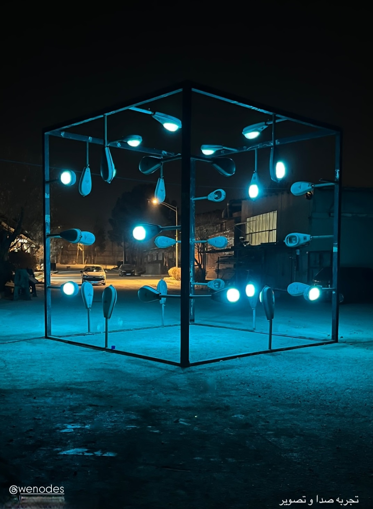

# LED Rod Controller for **Node Room** ✨

This project powers the interactive lighting installation **"Node Room"**, a metaphor for small and large human cycles. Visitors can influence and be influenced by the space through light and sound. An old control device allows participation in shaping the atmosphere.

This controller enables **live, sound-reactive lighting effects** using **ESP8266** and **WS2812B LED strips**. The system communicates over WiFi via UDP, making it ideal for real-time, dynamic environments.

> 🌀 _This is part of a larger interactive installation._  




---

## 💖 Support, Management, and Hosting

These interactive installations and its related event were generously supported, expertly managed, and graciously hosted by Wenodes ([https://wenodes.org/](https://wenodes.org/)). Their multifaceted contribution was essential to the success of this endeavor.

---
## 🔧 Features

- Live LED control via WiFi
- Reactive to sound and external input (expandable)
- UDP-based control protocol
- Support for up to **1000 WS2812B LEDs**
- Auto-timeout: LEDs turn off after 2 seconds of inactivity
- Static IP for consistent network behavior
- Built with **FastLED** for high-performance effects

---

## 🛠 Hardware Requirements

- **ESP8266** (e.g., NodeMCU)
- **WS2812B LED strip** (up to 1000 LEDs)
- 5V power supply (sized for your LED count)
- WiFi network or mobile hotspot

---

## ⚙️ Pin Configuration

- **LED Data Pin:** D1 (GPIO5)  
- **Status LED:** D4 (onboard LED)

---

## 🌐 Network Configuration

- **Static IP:** `192.168.43.101`  
- **Gateway:** `192.168.43.1`  
- **Subnet:** `255.255.255.0`  
- **UDP Port:** `8266`

---

## 📡 Control Protocol

UDP packet structure:
- **First byte:** `0xAA` (sync byte)
- **Next bytes:** RGB values for each LED (3 bytes per LED)

---

## 🚀 Setup Instructions

1. Update your WiFi credentials in the code:
   ```cpp
   const char* ssid = "your_ssid";
   const char* password = "your_password";
